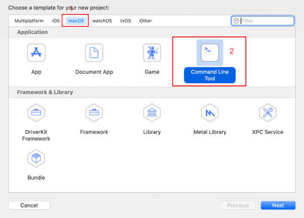

# Xcode创建工程

## XCode下载安装
在mac上打开“App Store”，搜索“xcode”后，一般xcode显示在第一个搜索结果。  
  
点击“获取”按钮即可安装，因为我的电脑上已经装了xcode，所以按钮显示的是“更新”。xcode非常大，约12G左右，所以提前预留好电脑空间，同时，App Store的服务器速度不怎么快，要有耐心哦，像我当时安装就是晚上点击了安装后去睡觉了，第二天早上一般就能安装成功了。

## 创建Command Line Tool工程
在Mac“启动台”内打开xcode，界面如下，点击左边的“Create a new Xcode project”。如下：


在打开的对话框内选择“macOS” -> “Command Line Tool”按钮，我们从无界面的程序开始学习。点击“next”按钮。如下：


为项目启一个合适的名字，这里我就启名叫helloword，语言选择“Objective-C”，点击“next”按钮，如下：  


为项目选择一个保存的位置，注意，项目会自动创建一个和你项目名称同名的文件夹，所以选择保存位置时不用为项目单独创建一个目录。

## XCode常用操作
先看我们HelloWorld工程建立后的默认界面  
  
1、这是我们的运行按钮，代码完成后点击它就可以运行了，一般第一次运行需要编译较多文件，时间会稍长。  
2、停止按钮，代码在运行过程中，这个按钮会处于可点状态，点击后当前运行的程序会停止。  
3、运行目标选择，当前我们建立的是Mac工程，所以运行目标是“my mac”，如果创建提IOS工程，这里可以选择手机或模拟器。  
4、这部分区域是文件导航区，默认第一个Tab是项目文件，另外还有搜索、断点及运行时出错的各个Tab，可以根据需要选择。  
5、项目配置，点击后在右边展示项目的相关配置。  
6、配置运行的Mac系统版本。  
7、编译目标的配置。  
8、属性配置面板。  
9、console输出和断点内存数值查看。  

## 命令行编译你的程序
如果你想装一下X，显得高级一点，不用IDE，直接使用命令行编译运行，可能使用clang编译工具。

使用Sublime Text或者直接使用vim来编写.m文件，如main.m，然后使用clang编译：

```
clang -fobjc-arc main.m -o prog1
```

如果没有编译错误，则已经编译出prog1可分行文件，直接执行即可：

```
./prog1
```